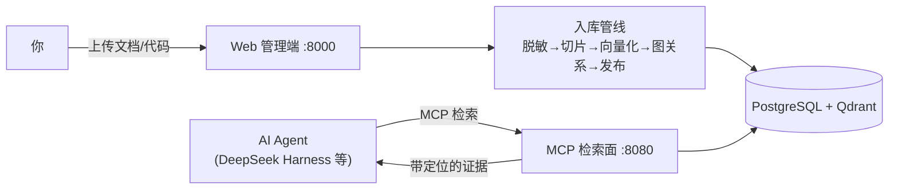

# 通用多知识域 RAG MCP 检索系统

把你的**文档与代码资产**变成 AI 可检索、可溯源的知识库——支持 **17 种文档格式**（Markdown、Word、PDF、Excel、PPT、邮件、Java / Python / Go 源码、SQL DDL、OpenAPI、JSON / YAML 等），全部可解析、切片、向量化入库（详见下文[支持的文档格式](#支持的文档格式哪些文档可以切片向量化)）。外部 AI Agent（DeepSeek Harness / ChatGPT App / Claude Code）通过 **MCP 协议**调用本系统，拿到**带来源定位的真实证据**——不幻觉、不跨项目串库、引用可核对。

> 本系统只做 RAG 的 **R（检索）**：它不生成任何产物，只负责"在正确的知识域里找到可信的证据"，生成交给你的 AI 客户端。

## 系统能干什么

- **多知识域隔离**：项目域 / 公共域 × 软件工程 / 通用文档 / 个人知识库 / 法律合规，每域独立向量库与元数据，跨域检索必须显式声明，串库率实测为 0
- **17 种格式一键入库，全部可切片向量化**：文档类（Markdown / Word / PDF / Excel / PPT / 邮件 / HTML / CSV / JSON / YAML / XML / txt）+ 代码与接口类（Java / Python / Go / OpenAPI / SQL DDL），解析与切片方式见[支持的文档格式](#支持的文档格式哪些文档可以切片向量化)
- **四条检索路径**：语义（Dense）→ 混合（BM25+RRF+Rerank）→ 图增强（调用图/外键/交叉引用扩展）→ Agentic（LLM 拆题+证据评估编排）
- **三个只读 MCP 工具**：`search_knowledge`（检索）、`get_evidence`（展开全文+父级上下文）、`list_knowledge_domains`（发现知识域）
- **每条证据可溯源**：`source_position` 精确定位（`com.foo.Bar#method` / `page:5 §3.2` / `# 章节路径` / `sheet:Sheet1`），版本号随证据返回
- **安全设计**：入库前凭据脱敏（密钥值永不进检索）、提示注入结构免疫、loopback 默认部署
- **Web 管理端**：项目/知识源/域档案管理，SSE 实时入库状态，中英文切换



## 支持的文档格式：哪些文档可以切片向量化

系统支持 **17 种格式**，全部走同一条入库管线：**脱敏 → 切片 → 向量化（bge-m3）→ 图关系 → 发布**。每个切片生成向量入库 Qdrant，并携带 `source_position` 来源定位；转换层切片以 512–1024 token 为目标，超长块在句子 / 换行边界二次切分。两种解析层的区别如下。

### 原生结构解析（8 种）——按文档自身结构切片，定位粒度最细

| 格式 | 扩展名 | 切片方式 | 来源定位 |
|---|---|---|---|
| Markdown | .md / .markdown | 按标题层级分章节，段落 / 列表 / 表格独立成块 | `# 章节路径` |
| Java | .java | 按类 / 方法符号 | `com.foo.Bar#method` |
| Python | .py | 按类 / 函数 / 方法符号 | 点分隔全限定符号路径 |
| Go | .go | 按函数 / 类型符号 | 符号路径 |
| OpenAPI | .yaml / .json（按内容自动识别） | 按 path / 端点定义 | 结构路径 |
| 数据库 DDL | .sql | 按建表语句 / 列定义 | 结构路径（表 / 列） |
| Word | .docx | 按标题结构分章节 | `# 章节路径` |
| PDF | .pdf | 按页 + 标题分节（需文本层） | `page:5 §3.2` |

### markitdown 转换层（9 种）——先转 Markdown，再按结构切片

| 格式 | 扩展名 | 切片方式 | 来源定位 |
|---|---|---|---|
| 纯文本 | .txt | 按段落分块 | `# <文件名>`（文档级） |
| CSV | .csv | 50 行窗口表格块 | `sheet:<文件名>` |
| HTML | .html / .htm | 按标题 / 段落 / 表格 | `# 章节路径` |
| JSON | .json | 按键路径递归切块 | `path:/a/b` |
| YAML | .yaml / .yml | 按键路径递归切块 | `path:/a/b` |
| XML | .xml | 按元素路径递归切块 | `path:/root/item` |
| Excel | .xlsx | 每个工作表一块 | `sheet:Sheet1` |
| PPT | .pptx | 按幻灯片标题切块 | `# 幻灯片标题` |
| 邮件 | .eml | 头部字段（From / To / Subject / Date）+ 正文 | `msg:<主题>` |

> - 上表内的格式都能切片向量化；注册表之外的格式在入库时被直接拒绝（状态 `failed` 并给出原因），不会污染检索库
> - PDF 扫描件没有文本层，需先 OCR 才能入库；单文件大小上限 20MB
> - Java / SQL DDL / Markdown 还会额外抽取图关系（调用图 / 外键 / 交叉引用），供图增强检索路径使用

---

## 前置准备

### 环境要求

| 依赖 | 版本 | 说明 |
|---|---|---|
| Python | ≥ 3.12 | 后端 |
| Docker / Docker Compose | 任意近期版本 | 起 PostgreSQL 与 Qdrant |
| Node.js + pnpm | Node 18+ / pnpm 8+ | 仅前端开发需要（用托管构建版则不需要） |
| 磁盘 | ≥ 5 GB | 两个模型约 2.5 GB + 数据 |
| 内存 | 建议 16 GB | CPU 模式跑 bge-m3 + reranker |

### 第一步：启动数据库

```bash
docker compose up -d
```

将启动 **PostgreSQL 16**（localhost:5432，库 `rag_mcp`，用户/密码 postgres/postgres）与 **Qdrant**（localhost:6333）。健康检查通过后进行下一步。

### 第二步：安装后端依赖

```bash
cd backend
pip install -e ".[ml]"        # ml 附带 sentence-transformers（Embedding/Reranker 必需）
```

### 第三步：下载模型到指定目录

模型统一放在仓库根目录的 `.models/huggingface/`。设置 `HF_HOME` 指向它，再执行预下载：

```bash
# 仓库根目录下执行（Windows PowerShell）
$env:HF_HOME = "$(Resolve-Path .)/.models/huggingface"

# Linux / macOS
export HF_HOME="$(pwd)/.models/huggingface"
```

```bash
# 预下载两个模型（bge-m3 约 2GB；bge-reranker-v2-m3 约 560MB）
python -c "from sentence_transformers import SentenceTransformer, CrossEncoder; SentenceTransformer('BAAI/bge-m3'); CrossEncoder('BAAI/bge-reranker-v2-m3')"
```

> - 国内网络可加镜像：`$env:HF_ENDPOINT = "https://hf-mirror.com"`（或 `export HF_ENDPOINT=...`）
> - 不预下载也可以：首次启动会自动下载，但 MCP 进程启动预热需等待较长时间
> - **`HF_HOME` 需要在启动后端服务的同一终端中生效**（或写入系统环境变量）

### 第四步：数据库初始化（迁移）

```bash
cd backend
alembic upgrade head          # 创建全部 18 张表（001→0074 共 20 个迁移）
```

> 可选：`cp .env.example .env` 按需修改连接信息；默认值与 docker-compose 一致，本机部署无需修改。

### 第五步：前端（可选）

```bash
cd frontend
pnpm install
pnpm build                    # 构建产物由管理面 :8000 自动托管（推荐）
# 开发模式（热更新，:5173，自动代理 /api → :8000）：
# pnpm dev
```

---

## 如何使用此系统

### 启动服务（两个进程，顺序启动）

```bash
# 终端 1 —— 管理面（writer，REST :8000，含入库/迁移/清理/Web 托管）
cd backend
python -m rag_mcp.server

# 终端 2 —— MCP 检索面（只读，:8080；启动时加载模型约 30–60 秒）
cd backend
python _run_mcp.py
```

> - 两个终端都需 `HF_HOME` 生效（模型预热）
> - 想扩展只读检索吞吐：`python _run_mcp.py --mode reader` 可再起多个 reader 实例（共享同一 PG/Qdrant）
> - 误启第二个管理面会因写者租约被拒绝启动——这是设计行为，防止双写

### 使用流程


1. **创建项目**：浏览器打开 `http://127.0.0.1:8000`（构建托管版）或 `http://localhost:5173`（开发版），创建项目（可填别名/仓库路径，创建后自动分配 **slug**，MCP 检索就用它）
2. **上传知识源**：进入项目详情，拖拽上传文件（单文件 ≤20MB），入库自动触发
3. **观察状态**：列表实时刷新（SSE）；`published` 即可检索；`failed` 显示原因，可点重试
4. **配置 AI 客户端**（下一节）→ 开始检索

### REST API 直用（不经 MCP 的用法）

```bash
# 创建项目
curl -X POST http://127.0.0.1:8000/api/projects -H "Content-Type: application/json" \
  -d '{"name": "my-project", "alias": "my-project"}'

# 上传文件（返回 source_id，后台异步入库）
curl -X POST "http://127.0.0.1:8000/api/knowledge-sources?scope_id=<知识域ID>" \
  -F "file=@UserService.java"

# 查看入库状态与失败原因
curl "http://127.0.0.1:8000/api/knowledge-sources?scope_id=<知识域ID>"

# 域档案管理（自定义领域：声明格式集/图词表/planner 提示词）
curl http://127.0.0.1:8000/api/projects/domain-profiles

# 运行指标（请求量/四态分布/P50P95/provider 用量）
curl http://127.0.0.1:8000/runtime/metrics
```

### 四条检索路径的开关（默认够用，进阶可选）

| 路径 | 启用方式 | 适用 |
|---|---|---|
| Dense / Hybrid | 无需配置（数据声明能力后自动 Hybrid） | 默认 |
| 图增强 | `.env` 中 `GRAPH_ENHANCED_RETRIEVAL_ENABLED=true`，且知识源重处理时勾选 graph_ready | "谁调用了 X / 哪些表引用 X" 类关系问题 |
| Agentic | `.env` 中 `AGENTIC_RETRIEVAL_ENABLED=true`（需配置 LLM_BASE_URL 等远程 LLM） | 复杂多跳问题（LLM 拆题+证据评估） |

---

## 记忆能力（012–015 外置记忆回路）

除检索之外，系统自 012 起提供**外置记忆回路**：事件日志是唯一权威，六个派生投影（关系 / 向量 / 链接 / 摘要 / 文件 / 显著性）都是只读派生视图。本节的结论**以实际实测为准，不以测试通过代替指标实测**。

### 六个 MCP 工具（工具面锁定，015 未新增）

- 只读旧三工具：`search_knowledge`、`get_evidence`、`list_knowledge_domains`；
- 记忆三工具：`recall_memory`（把记忆放回上下文）、`start_work`（工作集与摘要）、`record_memory`（写入记忆）。

015 不新增 MCP 工具、不改变既有工具的响应字节，也**不在 MCP 面暴露任何治理写入入口**。

### 分级信任

写入按 `provenance` 分级：

- `hard`（硬记忆）：**必须有锚**（`evidence_refs` 指向真实证据），无锚写入一律被拒；锚定率以实测为准。
- `soft` / `distilled`：必须带齐五项推断元数据（`INFERENCE_META_KEYS`），否则拒绝。

来源可定位率（证据路径）与记忆 provenance 完备率（记忆路径）**分项统计、不合并**。

### 治理与回滚边界（仅管理面）

下线（retire）、显式清理（purge）、回滚（rollback）、投影重建（rebuild）、晋升（promotion）、巩固（consolidation）**只在管理面 REST（writer 实例）可达**：

- 回滚要求 `actor=management` 且自身入权威日志；非管理面（MCP 面 / 非写实例 / 只读实例）的回滚尝试全部被拒（实测 `attempted=5 / succeeded=0`，含 403 与 503 `MEMORY_WRITE_UNAVAILABLE`）；
- 无显式 `scope_ref`（缺失、空串、纯空白）与歧义引用一律被拒（`MISSING_KNOWLEDGE_SCOPE` / `AMBIGUOUS_DOMAIN_REF`）并**给出候选域**，"回落最近域 / 全库"成功次数实测为 0；缺失与歧义分别构造用例、分别记分；
- 晋升是**显式人工动作**，无自动晋升入口；巩固（`consolidation_enabled`）与链接扩展（`link_expansion_enabled`）**默认关闭**；
- 首期治理动作**仅单条**，无批量入口；批量列为触发条件。

### 评测与硬指标现状（015 建立锚点，不宣称改进）

- 三份冻结子集：多会话连续性 16 条（014 建立，沿 014 既有判据）、巩固受益 6 条（013 建立，沿 013 相对提升口径，基线为零即不可计算）、投毒防护 11 条（015 新建，纯合成，9 条 primary 全高危档 + 2 条对照不计入拦截率）；
- AOEP 状态义务用例 13 例，覆盖五条不变量（回滚可溯 / 删除传播 / 权威单调 / provenance 保全 / 范围不扩张），逐例产出请求标识、状态、前后指纹、影响面与可复现记录；
- 六件套硬指标（跨域串库四路径、六工具契约合法率、来源可定位率、记忆 provenance 完备率、硬记忆锚定率、隔离泄漏）加两个新增子块（投影可复算、六轴状态元数据齐备率）逐项给出**真实分母与口径**，结果落在 `eval/memory_baseline_report.json`（历史产物，不覆盖重写）；
- **014 遗留的 `cross_domain_leakage` 曾因分母为零记为不可测量**（不是 0）；015 对四条路径分别重测并给出各自分母与结论，具体数值以 `eval/memory_baseline_report.json` 为准；
- **巩固受益未达成**：013 的发布结论为 `incomplete`、`default_enable_eligible=false`、开关默认关闭、无可主张受益，015 **如实继承且不改写**，也不宣称任何提升；
- **零分母不是 0**：任何分母为零的项一律记 `not_measurable` + 原因，绝不记 0、绝不记达标；**测试通过 ≠ 指标实测达标**。

### 隐私边界

- 统计端点 `GET /api/memories/stats?scope_ref=<域>` 只返回计数与分位（`total` / 各分型与 provenance 与状态分布 / 显著性分位与分桶 / 巩固运行与回滚计数），**响应中不存在任何正文键**；把正文追踪开关打开（`TRACE_BODY_ENABLED=true`）时响应**逐键相同**；
- 该端点挂在既有 `/api/memories` 路由上、要求显式域参数，**不并入也不改动** `GET /runtime/metrics`；
- 治理 UI **未选域时不发起任何返回正文的请求**，六视图一律空态，没有"清空域以跨域浏览"的路径；
- **SSE 边界（如实说明）**：`publish_event` 在 `backend/` 内没有调用点，当前流只发心跳；因此治理 UI 的正确性来自 REST 拉取（挂载时 + 每次治理动作后 + 手动刷新）。SSE 未接线**既不算 UI 未达标，也不能反过来当作正确性论据**。

---

## 搭配 DeepSeek Harness 使用（推荐提示词格式）

### MCP 配置

在 Harness 的 MCP 配置（`mcpServers`）中加入：

```json
{
  "mcpServers": {
    "rag-mcp": {
      "url": "http://127.0.0.1:8080/mcp"
    }
  }
}
```

连接后 AI 即可看到三个工具。**建议把下面这段提示词放进系统提示 / 项目指令（如 CLAUDE.md、AGENTS.md 或会话开场），教 AI 正确使用知识库：**

### 推荐系统提示词（直接复制）

```markdown
# 项目知识库使用规范（rag-mcp）

你可以通过 MCP 服务器 rag-mcp 访问项目知识库，请严格遵守：

1. 【先发现】会话开始涉及项目知识时，先调用 list_knowledge_domains
   查看可用知识域，记下目标域的 slug。
2. 【必须带作用域】调用 search_knowledge 时必须传 domain_scope（填 slug
   或数字 ID），禁止无作用域检索；跨库问题可传多个域。
3. 【先检索后回答】凡涉及项目事实——API、表结构、类与方法、配置、
   业务规则、文档条款——必须先检索证据再回答，禁止凭训练记忆猜测。
4. 【展开核对】对将要写进产物的关键证据（代码引用、字段清单、条款），
   先用 get_evidence 展开全文核对，摘录与全文冲突时以全文为准。
5. 【注明来源】引用证据时注明其 source_position（如
   com.foo.UserService#validateToken 或 page:5 §3.2），便于人工核对。
6. 【诚实对待缺口】completion_status 为 partial / no_evidence 时，如实
   说明证据缺口（gaps 字段），明确标注"未在知识库中找到依据"的部分，
   不要编造。
7. 【区分事实与推断】证据若带 relation 且 is_hard=false，是系统推断的
   软关系，引用时须注明"推断"。
```

### 推荐用户提示词模板

```
在知识域「{slug}」中检索：{你的问题}
```

场景示例：

```
在知识域「my-project」中检索：Order 表有哪些字段？各字段类型和约束是什么？

在知识域「order-service」中检索：谁调用了 validateToken 方法？给出调用方与调用位置。

跨「order-service」和「pay-service」两个知识域检索：两边的鉴权方案有什么差异？
```

### 不使用 Harness 的其他用法

- **任何 MCP 客户端**（ChatGPT App / Claude Code / Cursor 等）：按各自的 Streamable HTTP MCP 配置方式接入 `http://127.0.0.1:8080/mcp` 即可，工具契约完全一致
- **脚本直调**：MCP 端点兼容标准 JSON-RPC（initialize → tools/call），可用任何 MCP SDK 调用
- **评测/批处理**：`eval/` 目录内置固定评测集与对照运行器（`run_eval.py` / `run_comparison.py` 等），可对任意知识域复现检索质量指标，方法见 [eval/README.md](./eval/README.md)

---

## 常见问题

| 现象 | 原因与处理 |
|---|---|
| MCP 启动卡在"Loading embedding model" | 首次加载模型正常（30–60s）；确认 `HF_HOME` 生效、模型已预下载 |
| 误启第二个管理面被拒 | 单写者租约保护（预期行为）；日志会给出当前持有者 |
| reader 启动报 schema 版本不一致 | 先启动 writer 管理面执行迁移（`alembic upgrade head`），再起 reader |
| 上传后状态一直 failed | 详情列有失败原因：常见为格式不支持（见「支持的文档格式」一节）、空文件、PDF 无文本层（扫描件需先 OCR） |
| 检索返回 no_evidence | 确认知识源已 published、domain_scope 传了正确 slug（先用 list_knowledge_domains 核对） |
| 检索返回 partial | 某条子路径降级（见 gaps/failed_paths）；证据仍可用，注意缺口 |
| 凭据会不会被检索出去 | 不会：入库前 api-key/password/token/secret 的值已替换为 `<api-key>` 等占位符，字段名保留 |

